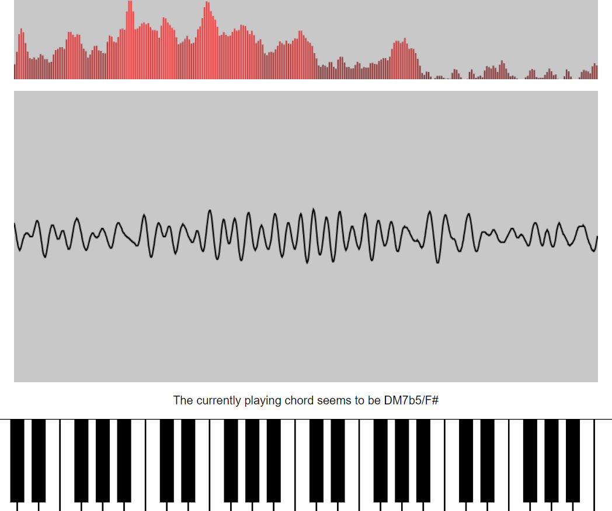

# Test for a live chord app

Screenshot:

The goal would be to be able to select the current source, so either the mic or an app, and then show the currently detected frequencies, chords, and notes, etc.
